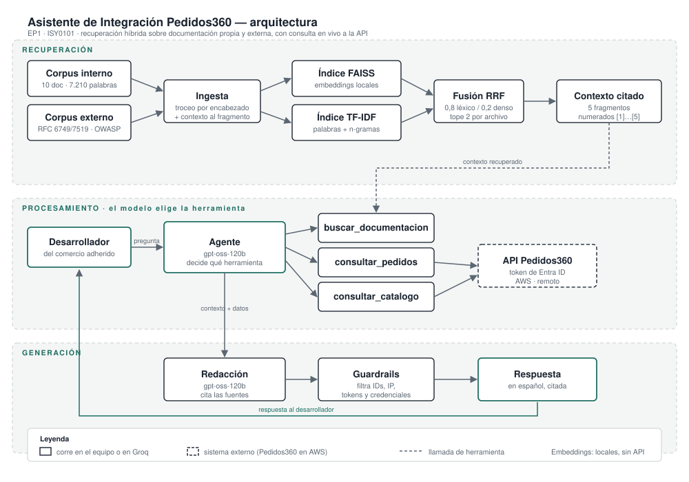

# Asistente de integración para Pedidos360: diseño de una solución con LLM y RAG

**Evaluación Parcial N°1 — ISY0101 Ingeniería de Soluciones con IA**
Ismael Oyarzún · Felipe Angel — Duoc UC, septiembre de 2026

> **Nota para el equipo, borrar antes de entregar.** Los apartados **E** y **F** están sin
> redactar a propósito: la pauta prohíbe usar IA para justificaciones técnicas,
> conclusiones y reflexiones. Ahí están los hechos ordenados y las preguntas que deben
> responder. Todo lo demás está redactado y cada cifra es reproducible con los comandos
> del `README.md`.
>
> **El límite de cinco páginas está justo.** El PDF generado con
> `python scripts/convertir_informe.py` ocupa exactamente 5 páginas **con E y F todavía sin
> escribir**. Al reemplazar ese andamiaje por prosa propia es casi seguro que se pase, así
> que hay que recortar. En este orden, y nunca las tablas ni la figura, que es donde se
> concentra la evidencia:
> 1. La declaración de uso de IA, moviéndola a un anexo fuera del cuerpo del informe.
> 2. El párrafo de A que describe la plataforma, resumible en dos líneas.
> 3. Las explicaciones de por qué perdieron las variantes B y C en el apartado B: basta la
>    tabla y una frase, aunque el detalle es de lo más interesante que tiene el informe.
> 4. El último párrafo de D, sobre que el asistente no modifica Pedidos360.
>
> En `referencias-disponibles.md` están las fuentes académicas verificadas para citar en E,
> con una tabla de qué respalda cada pregunta. Buscar referencias es de lo que la pauta sí
> autoriza apoyar con IA; redactar el argumento, no.
>
> Vuelvan a ejecutar el conversor después de escribir E y F para contar páginas de verdad.
> Si el docente exige el interlineado doble de APA 7, el texto no cabrá en cinco páginas
> por mucho que se recorte: háganle esa pregunta antes de maquetar. La tipografía se
> cambia en un solo sitio, al principio de `scripts/convertir_informe.py`.

---

## A. Análisis del caso organizacional (IE1)

**Pedidos360** es una PYME tecnológica chilena que ofrece a comercios asociados una
plataforma B2B de gestión de pedidos entregada como API, con autenticación federada: cada
comercio accede con el Microsoft Entra ID que ya usa internamente. Está operativa sobre
AWS con tres microservicios Spring Boot y tres emisores de identidad simultáneos.

**El problema es el onboarding técnico.** Cada comercio nuevo necesita que un
desarrollador entienda qué emisor le corresponde, cómo obtener un token, qué *scopes*
necesita y qué significa cada error, información repartida entre un README, seis
documentos técnicos, un CHANGELOG, dos colecciones de API y el código fuente.

El caso no es hipotético y se comprobó contra el sistema en producción. Un token emitido
por el propio `ms-auth`, con `iss` correcto, audiencia `exp1-api` y los *scopes*
`pedidos.leer pedidos.escribir`, recibe **HTTP 401** al llamar `GET /v1/pedidos`. La causa
es que esa ruta está enlazada al autorizador de **Entra ID**, mientras el autorizador del
IdP propio solo cubre `/auth/userinfo`. Deducirlo exige cruzar la documentación de
autenticación con la configuración real del gateway. Ese es el tipo de consulta que hoy
termina en el equipo de ingeniería.

**Objetivos de la intervención**

| # | Objetivo | Métrica | Meta | Resultado |
|---|---|---|---|---|
| O1 | Cubrir las consultas frecuentes | Preguntas con relevancia ≥ 0,75 | ≥ 85% | **100%** (30/30) |
| O2 | Respuestas apoyadas en las fuentes | *Faithfulness* | ≥ 0,80 | **0,95** |
| O3 | Respuestas útiles | *Answer relevancy* | ≥ 0,80 | **0,98** |
| O4 | Recuperar el contexto correcto | *Context recall* | ≥ 0,70 | **0,92** |
| O5 | Responder sobre datos actuales | Consultas resueltas contra la API | ≥ 90% | cumplido |
| O6 | No filtrar información sensible | Identificadores en las respuestas | 0 | **0** (17 pruebas) |

Todas se reproducen con los comandos del `README.md`, y las de generación están medidas
sobre las 30 preguntas, no sobre una muestra.

## B. Formulación de prompts (IE2)

Se escribieron tres variantes del prompt de sistema, todas con las mismas reglas de
negocio y distinta estrategia de razonamiento, y se midieron sobre la misma submuestra,
con la misma recuperación y el mismo evaluador. Lo único que cambia es el prompt.

| Variante | Técnica | Fidelidad | Relevancia |
|---|---|---:|---:|
| **A** | Zero-shot: reglas enunciadas, sin ejemplos | **1,00** | **1,00** |
| B | Few-shot: las reglas más dos ejemplos resueltos | 0,94 | 1,00 |
| C | Chain-of-thought: un procedimiento de razonamiento previo | 0,84 | 0,88 |

**Gana la más simple**, y las otras dos pierden por motivos opuestos:

- **B inventó un detalle.** Al preguntarle si la base de datos es alcanzable desde
  internet añadió que solo acepta conexiones «desde el *security group* de la EC2»: cierto
  en espíritu, pero ausente del contexto recuperado. Los ejemplos empujan a elaborar.
- **C se volvió demasiado escrupuloso.** Su paso de razonamiento pedía descartar fragmentos
  sobre casos distintos al preguntado, y acabó respondiendo «no se encuentra en la
  documentación» sobre el flujo OAuth del frontend, que **sí estaba** en el contexto. Una
  instrucción puesta para evitar alucinaciones produjo el error contrario.

El prompt adoptado (A) fija cuatro reglas que sí resultaron necesarias: citar los
fragmentos como `[n]`, declarar cuando una herramienta no está disponible en vez de
inventar cifras, responder **todas** las partes de una pregunta múltiple, y no revelar
identificadores de infraestructura.

## C. Diseño e implementación del pipeline RAG (IE3, IE4)

**Fuentes.** El corpus combina dos orígenes, etiquetados por separado porque la confianza
que merecen es distinta:

| Origen | Contenido | Volumen |
|---|---|---|
| Interno | Documentación de Pedidos360: README, seis documentos técnicos, CHANGELOG y una guía de errores frecuentes escrita en este proyecto | 10 archivos · 7.210 palabras |
| Externo | RFC 6749 (OAuth 2.0), RFC 7519 (JWT) y OWASP API Security Top 10, acotados a las secciones pertinentes | 3 archivos · ~4.100 palabras |

Los RFC se recortan a propósito: completos —29.000 palabras en inglés— desbalancearían la
recuperación frente a la documentación propia en español.

**Troceo.** División por encabezado de Markdown y luego por tamaño, anteponiendo a cada
fragmento su documento y sección. Sin ese encabezado, un fragmento tomado de la mitad de
`03-api-gateway.md` no menciona en su texto ni «API Gateway» ni su sección, y su vector no
se parece a una pregunta que use esas palabras. El tamaño se fija por origen: los RFC son
texto plano con listas indentadas largas, y con el tamaño de la documentación propia las
definiciones de error quedaban partidas a mitad de frase. Resultado: 145 fragmentos.

**Recuperación híbrida.** Búsqueda densa con embeddings locales multilingües, búsqueda
léxica TF-IDF, y fusión de ambos rankings con *Reciprocal Rank Fusion*, con un tope de dos
fragmentos por archivo.

| Estrategia | Context recall | Context precision | Preguntas sin fuente |
|---|---:|---:|---:|
| Solo semántica | 0,80 | 0,58 | 2 |
| Híbrida, pesos iguales | 0,78 | 0,51 | 4 |
| **Híbrida 0,8 / 0,2 con tope** | **0,92** | **0,45** | **0** |

Dos advertencias sobre esta tabla. **La versión híbrida inicial, con pesos iguales, resultó
peor que la búsqueda semántica sola**; solo la medición lo detectó. Y la precisión se lee
contra su techo: con cinco fragmentos y tope de dos por archivo, una pregunta con una sola
fuente no supera 2/5, y el máximo sobre el set es 0,55 — el 0,45 medido es el 82% de lo
posible.

**Evaluación (IE4).** Un set de 30 preguntas con la fuente esperada y una respuesta de
referencia. La recuperación se mide sin modelo y es determinista. La generación usa un
modelo como juez con rúbrica de cinco niveles, verificada antes de usarla con cuatro
respuestas construidas a propósito —correcta, incompleta, con un dato inventado y falsa—
que debe ordenar. Las ordena. Resultado: **fidelidad 0,95 · relevancia 0,98**, con 26
respuestas de fidelidad perfecta y las 30 sobre 0,75 de relevancia.

**Una respuesta correcta puede no estar fundamentada.** Al ampliar la medición de 8 a 30
preguntas aparecieron tres casos con fidelidad 0,00 y relevancia 1,00: el asistente
respondía bien —que OAuth 2.0 devuelve `invalid_client` cuando falla la autenticación del
cliente— pero el término no estaba en el contexto recuperado, porque el troceo había
cortado la lista de errores del RFC. Respondió de memoria. Es el fallo que un pipeline RAG
debe evitar y que la fidelidad existe para detectar: el conocimiento previo del modelo
enmascaraba un hueco de recuperación. Corregido el troceo, 0,88 → 0,95.

**Coherencia entre datos y respuestas.** El corpus contenía una contradicción real: el
README afirma dos veces que el frontend es «SPA React + Vite» cuando es Angular.
Preguntado, el asistente respondió **Angular**, correctamente, teniendo el fragmento
equivocado en el contexto. Pero **no mencionó** que una fuente lo contradice: resolvió el
conflicto en silencio, y con la distribución invertida nada garantiza el mismo resultado.
También se corrigió una respuesta de referencia del propio set, que afirmaba cerrado un
puerto que la documentación da por abierto: el set de evaluación también se equivoca.

## D. Arquitectura de la solución (IE5, IE6)

*Figura 1. Arquitectura del asistente. Trazo continuo: componentes propios; discontinuo:
sistema externo.*

La solución se organiza en los tres módulos del indicador. **Recuperación:** los dos
corpus se trocean e indexan en paralelo en un índice vectorial y uno léxico; ante una
consulta se buscan ambos y se fusionan sus rankings, entregando cinco fragmentos citables.
**Procesamiento:** un agente con tres herramientas —`buscar_documentacion`,
`consultar_pedidos` y `consultar_catalogo`— decide cuál usar; el enrutamiento no está
cableado con reglas, y es lo que permite resolver una pregunta mixta como «¿cómo obtengo
el listado por API y cuántos llevo?», que necesita documentación *y* estado actual. Ese
caso es la razón de usar un agente y no un RAG plano, y está detallado en el boceto de
secuencia del repositorio. **Generación:** el modelo redacta citando los fragmentos y la
salida pasa por un filtro que elimina identificadores de infraestructura, tokens y
credenciales, que aparecen legítimamente en el corpus pero no deben llegar al usuario.

El asistente **no modifica Pedidos360**: lo consume como cualquier comercio integrado,
autenticándose por el mismo mecanismo OAuth 2.0, con la URL parametrizada para apuntar al
despliegue en AWS o a un entorno local equivalente.

## E. Documentación técnica: justificación de decisiones (IE7, IE8)

> **A redactar por el equipo.** Los hechos están arriba; falta el porqué. Preguntas que la
> justificación debe responder, en orden:
>
> 1. **¿Por qué RAG y no un LLM respondiendo de memoria?** Pensar en la trazabilidad, en
>    poder citar la fuente, y en el costo de una respuesta inventada sobre autenticación.
> 2. **¿Por qué un agente con herramientas y no solo recuperación documental?** El dato de
>    «cuántos pedidos llevo» no está en ningún documento.
> 3. **¿Por qué fuentes internas y externas?** ¿Qué aporta el RFC que no aporte el README?
> 4. **¿Por qué embeddings locales y no de un proveedor?** Groq no ofrece ese endpoint;
>    ¿qué otras ventajas tiene, y qué se pierde?
> 5. **¿Por qué el ranking se calcula en la herramienta y no lo hace el modelo?** Antes de
>    ese cambio, el asistente respondía mal cuál producto factura más.
> 6. **¿Qué decisión tomaría distinto la organización si la métrica de precisión fuera
>    real y no estuviera acotada por el tope?**

## F. Conclusiones y reflexiones individuales (IE9)

> **A redactar por el equipo, sin apoyo de IA.** La pauta exige una reflexión personal por
> integrante, explicando el aprendizaje y la contribución propia. Material disponible:
> tres defectos detectados y corregidos, una hipótesis técnica descartada por medición, y
> una mejora que empeoró el sistema hasta que se midió.

## G. Referencias

Internet Engineering Task Force. (2012). *RFC 6749: The OAuth 2.0 authorization
framework*. https://www.rfc-editor.org/rfc/rfc6749.txt

Internet Engineering Task Force. (2015). *RFC 7519: JSON Web Token (JWT)*.
https://www.rfc-editor.org/rfc/rfc7519.txt

Ley N° 19.628. *Sobre protección de la vida privada*. Diario Oficial de la República de
Chile, 28 de agosto de 1999.

OWASP Foundation. (2023). *API Security Top 10*.
https://owasp.org/API-Security/editions/2023/en/0x11-t10/

*[Añadir las usadas en E y F; hay cuatro verificadas en `referencias-disponibles.md`.]*

## Declaración de uso de Inteligencia Artificial

Se utilizó **Claude (Anthropic)** como herramienta de apoyo para: análisis de la pauta,
inventario de la documentación existente, implementación del pipeline y de las pruebas,
generación de los datos de demostración, elaboración del diagrama y estructuración de este
documento. **No se utilizó IA** para la justificación de decisiones técnicas (apartado E),
las conclusiones ni las reflexiones individuales (apartado F). Todo contenido generado con
apoyo de IA fue revisado y validado por el equipo. Referencia: https://bibliotecas.duoc.cl/ia
